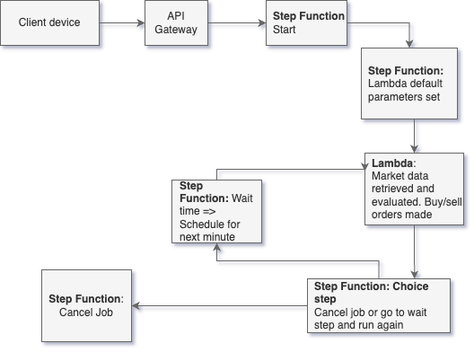

# Trade Job

## Intro

This repository holds the files relating to the setup and running of a system in AWS that evaluates market 
data 
relating to a particular stock, and makes buy or sell orders based on defined conditions.   

## Technical overview

The AWS infrastructure is defined in the `serverless.yaml` file. This defines a REST API endpoint which takes a POST
request and passes the data to a Step Function. The Step Function passes the parameters to a Lambda function which
encapsulates the logic of retrieving the stock data, and processing and evaluating it to decide whether an order should
be placed. This execution of the lambda is referred to as a trade "run". Once the run is complete, the Step Function
resumes and schedules another run to start at the beginning of the next minute, and the process begins again. This will
continue until:

- Either the stop-loss or take-profit limits are reached - at which point all positions are closed
- The Job is manually cancelled by the user

A flowchart of the process is shown below:



More details on the individual steps in the process are explained below.

### 1. API Gateway
A JSON payload is sent in the form of a POST request, and contains the information regarding a stock and the 
parameters to be used when evaluating whether to make a buy or sell order. The details on these parameters are given below:
```
symbol - Required, stock Symbol to be traded
offsetTime - Look back time in minutes of the end of the data evaluation window. Default 16
windowLength - evaluation window size, minutes. Default 5
minimumPoints - minimum points required to be in a window for the data to be evaluated. Default 3
stopLoss - Default null
takeProfit - Default null
```
The JSON payload is passed to the Step Function.

### 2. Step function
The Step Function first sets the default values for any parameter which has not been set. It then passes this to the 
Lambda function. The Lambda will complete it's run, which will evaluate the data and either make a buy, sell order 
or do nothing.

### 3. Lambda Function
The Lambda function:
1. Retrieves **all** orders for symbol from Alpaca API since job was started
2. Retrieves all open positions
3. Calculates current profit/loss
4. Evaluates whether profit/loss limits reached
   1. if limits have been reached, then sell all open positions and cancel the job
5. Calculates the moving average over the time window and compares the last available price to it:
   1. if the last price is above the average, a buy market order is made 
   2. if the last price is below the average, and a position is currently held, a sell market order is made 
   3. if none of these conditions are fulfilled, then no action will be taken, and the run will continue
6. Check is then done on whether the maximum number of runs has been reached 
   1. if the maxmimum number has been reached:
      1. cancel open orders, close all positions
      2. return indicator that the job should be cancelled (`cancelTradeJob: 1`) to step function
   2. if maxmimum number not reached, return indication that job should not be cancelled (`cancelTradeJob: 0`)

### 4. Step Function
Output from Lambda function is checked to see whether job should be cancelled
  - if cancelTradeJob = 1 the job is ended
  - if cancelTradeJob = 0 the Lambda is run again


## Running the workflow
An example payload with all parameters is given below:

```
       {
        "symbol": "AAPL", // required
        "offsetTime": 16, // required, look back time in minutes of the evaluation window to set when retrieving data. 
        Defaults to 16 as Alpaca API free version has a 15 min delay on latest available data
        "windowLength": 5 // required, 
        "minimumPoints": 3, // minimum points required to be in a window for the data to be evaluated
        "stopLoss": null,
        "takeProfit": null,
        "maxRuns": 3 // maximum number of runs of the lambda
       }
```

To trigger the workflow, a POST request can be made to the API Gateway endpoint e.g. using cURL:
```
curl -v --header "Content-Type: application/json" \
  --request POST \
  --data '{"symbol": "AAPL", "offsetTime": 16, "windowLength": 5, "minimumPoints": 3, "takeProfit": 1000, 
  "stopLoss": -2000}' -H  "x-api-key: <api_key>" \
<API_gateway_url>/dev/startTradeJob
```
